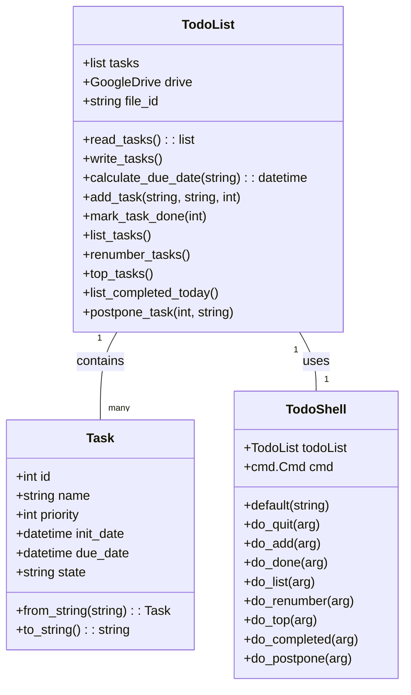

# Todo List Program

This program is a command-line tool written in Python for managing a todo list. The tasks are stored in a text file on Google Drive, which allows for easy access and synchronization across multiple devices. The program supports various commands such as adding a task, marking a task as done, listing all tasks, postponing a task, and listing tasks that were completed today. It uses the PyDrive library to handle the communication with Google Drive.


# Installation Instructions

This project requires Python 3.8+ and the following Python libraries installed:

- PyDrive
- dateutil
- argparse

The simplest way to install these is using a Conda environment. Conda handles package dependencies and environments in a seamless manner. You can install the required packages using the `requirements.txt` file included in the repository.

To create a new Conda environment and install the required packages, run the following command:

```bash
conda create --name <env> --file requirements.txt
```
Replace <env> with the name you want to give to the environment.

Next, activate the environment with this command:

```bash
conda activate <env>
```

## PyDrive Quickstart Instructions

To get started with PyDrive, you will need to create a project on the Google Cloud Console, enable the Drive API, and obtain an OAuth2 client ID and client secret. 

1. Visit the [PyDrive Quickstart page](https://pythonhosted.org/PyDrive/quickstart.html). 

2. Follow the instructions provided to create your project.

3. Once your project is set up, enable the Drive API.

4. Obtain your OAuth2 client ID and client secret.

After completing these steps, you will need to download a JSON file containing these credentials. This file is critical for authorizing your application's access to your Google Drive account.


## Quick Examples

After installation, you can start the program with the command:

```bash
python todo.py
```

This will open the todo command shell. From here, you can issue various commands.

```bash
(todo) > add "My first task" -d 2023-12-31 -p 1
(todo) > ls
(todo) > done 1
(todo) > quit

```

You can also use the command line interface to interact with the program. Here are some examples:
```bash
python main.py a "My second task" -d 2023-12-31 -p 2
python main.py d 2
python main.py l
python main.py ren
python main.py top
python main.py p 2 1w
```
# Usage

This program can be run in two modes: interactive and command line.

## Interactive Mode

To start the interactive mode, simply run the program without any arguments:

```bash
python todo.py
```


### Available Commands

Here is a list of commands that you can use in this application:

1. **add** : This command is used to add a new task. 
    ```bash
    add "TASK_NAME" [-d DUE_DATE] [-p PRIORITY]
    ```
    * TASK_NAME : The name of the task.
    * DUE_DATE : The due date for the task. Can be 'today', 'tomorrow', '1w' (for 1 week from now), or a date in the format 'YYYY-MM-DD'. Default is one week from today.
    * PRIORITY : The priority of the task. Can be an integer between 1 (highest) and 5 (lowest). Default is 5.

2. **done** : This command is used to mark a task as done. 
    ```bash
    done TASK_ID
    ```
    * TASK_ID : The ID of the task you want to mark as done.

3. **ls** : This command lists all tasks that are not marked as done. 
    ```bash
    ls
    ```

4. **renumber** : This command renumbers all tasks. 
    ```bash
    renumber
    ```

5. **top** : This command lists the top 5 tasks (not marked as done) with highest priority. 
    ```bash
    top
    ```

6. **completed** : This command lists all tasks completed today. 
    ```bash
    completed
    ```

7. **postpone** : This command is used to postpone a task.
    ```bash
    postpone TASK_ID DURATION
    ```
    * TASK_ID : The ID of the task you want to postpone.
    * DURATION : The duration to postpone. It can be in the format '1d' (for 1 day) or '1w' (for 1 week).

8. **quit** : This command is used to exit the application.
    ```bash
    quit
    ```

## Command Line Usage

You can also use this application directly from the command line. Here is how to use the command line arguments:

```shell
python todo_list.py COMMAND ARGS
```

## Frequently Asked Questions

1. **Q: How do I install the dependencies?**

   A: Run `conda create --name <env> --file requirements.txt` to create a conda environment with the necessary dependencies.

2. **Q: How do I create and access the Google Drive file?**

   A: Follow the PyDrive Quickstart instructions available at: https://pythonhosted.org/PyDrive/quickstart.html

3. **Q: How can I add a new task?**

   A: Use the command `add` followed by the task name, due date and priority. For example: `add "New Task" -d 2023-10-10 -p 1`.

4. **Q: What is the task priority range?**

   A: Task priority ranges from 1 (highest) to 5 (lowest).

5. **Q: How do I mark a task as done?**

   A: Use the command `done` followed by the task ID. For example: `done 1`.

6. **Q: I accidentally marked a task as done. Can I undo this action?**

   A: No, not supported yet

7. **Q: Can I modify an existing task?**

   A: No, not supported yet

8. **Q: How do I view all tasks?**

   A: The `list` command will show you all tasks. You can also use the `top` command to view the top 5 tasks with highest priority.


## Architecture

The architecture of this todo list application is based on the concept of Tasks and their management through a TodoList. The architecture can be visualized as follows:



## License

"THE BEER-WARE LICENSE" (Revision 42):
niclas.lindmark@gmail.com wrote this file. As long as you retain this notice you can do 
whatever you want with this stuff. If we meet some day, and you think this 
stuff is worth it, you can buy me a beer in return.
